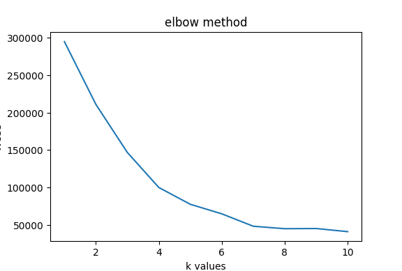

# k-means Clustering

Its a unsupervised ML algorithm. Meaning it uses **unlabeled dataset** to learn patterns.

**Core idea**  
**This algorithm groups similar data points from dataset. This groups are called _clusters_.**

## Working of K-means clustering

**_Steps_**

1. Initialize the k centroid values. This are center points of k cluster.

2. Each data point is assigned to the nearest centroid based on a distance metric, usually **Euclidean distance**.

_This step ensures that each point is grouped with other similar points, forming the initial clusters_

3. Once all points are assigned to clusters, the algorithm recalculates the centroids by taking the mean of the data points in each cluster.

4. _Steps 2 and 3_ are repeated until the centroids stop moving or the change in their positions is negligible. This indicates that the algorithm has converged and the clusters are stable.

**_The final clusters are then outputted as the result of the K-Means algorithm_**

## Implementation

Before actual implementation, we need to -

1. **Preprocess the data by identifying and removing outliers, because k-means is sensitive to outliers**

2. **Choose the optimal value of k (number of clusters) using Elbow method or Silhouette Score**

3. **Select the appropriate initial centroid values by running algorithm with multiple initialization centroid values.**

### Detect Outliers using IQR (Interquartile Range)

IQR is simply, `Q3 - Q1`, where ,

_Q1 is value which represent 25% of data is below that value (Q1)_

_Q3 is value which represent 75% of data is below that value (Q3)_

> Q2 is value which represent 50% of data is below that value (Q2)

Example, data `[21,23,24,26,28,30,31,32,35,78]`,

so, first sort it (alredy sorted)

So, Q1 = 0.25 x (no. of data points - 1) = 0.25 x 10 = 2.5, means data points at index 2 and 3. So,take average of them,

`24 + 26 / 2` = 25, meaning 25% of data points are below 25. SO **_Q1 = 25_**

Similarly, for Q3, we get `32 + 35 / 2` = 33.5, So, **_Q3 = 33.5_**  
Meaning, 75% of data points are below 33.5

So, we get Q1 and Q3. **_This means, we got to know that 50% of data points in dataset is between 25 (Q1) & 33.5 (Q3) _**

> **_Because 75% - 25% is 50%. And since, 25% of data is below 25 & 75% of data is below 33.5_**

Now, **_the middle 50% of data lives between 25 and 33.5. Everything between these two values is the "normal bulk" of our data_**

**But**,

- **_we can't throw everything which are outside of this range (i.e Q3 - Q1), because values slightly outside this range are still perfectly normal — they're just on the fringe_**

- **_Also, this is range is just 50% of whole data_**

Since, `IQR = Q3 - Q1`, and this IQR is range of normal data points (i.e 33.5 - 25 = **8.5**)

So, we extend each side by 1.5 × IQR

```
Lower fence = Q1 - (1.5 × IQR) = 25 - (1.5 × 8.5) = 25 - 12.75 = 12.25
Upper fence = Q3 + (1.5 × IQR) = 33.5 + (1.5 × 8.5) = 33.5 + 12.75 = 46.25
```

**Acceptable zone = [12.25, 46.25]**

Now we compare each data point against this acceptable zone [12.25, 46.25].
Any data point that falls below 12.25 or above 46.25 is an **outlier** and gets removed.

In our example, `78` falls outside the upper fence (46.25), so it gets removed.
Clean dataset: `[21, 23, 24, 26, 28, 30, 31, 32, 35]`

> [!NOTE]  
> For dataset with multiple features, You apply IQR independently to each column, and remove a row if it's an outlier in any column.
> One bad feature poisons the whole row

### Choose optimal K (number of clusters) using Elbow method

K is numbers of clusters (groups) in which data will divide. But as we dont know anything about data, we dont know in how many groups it will divide.

**That means, we don't know how many groups to form.**

So, to find the optimal k, we use **_Elbow method_**

##### Elbow method

**_Elbow method is simply_**,  
**Run k-means algorithm for each k values (from 1 to 10), and calculate final WCSS (Within Cluster Sum of Square) for each k values.**

**WCSS measures how tightly packed each cluster is —
for every point, calculate its squared distance from
its cluster's centroid, then sum all of those up.
Lower WCSS means tighter, better-formed clusters.**

**After this, we plot graph where on X-axis, we have k values, and on Y-axis, we have WCSS.**

**The point on graph where WCSS starts to decrease very slightly, and forms a elbow shape, that point's k value is optimal value**

```
WCSS
|
|*
| *
|  *
|    *
|       * * * * *
|_________________________ k
         ^
        elbow = optimal k
```

**WCSS calculation**,

- Calculate squared distance (means same as Euclidean, just don't take square root at the end) of a point and its cluster's centroid

- Do above step for each point in cluster and then sum up all of them to get _WCSS_ for that cluster.

- Calculate _WCSS_ for each cluster and sum them all to get _final WCSS_ for current `k` value

- Calculate _final WCSS_ for each `k` value

- Plot line graph where on,  
  `X-axis we have K values`  
  `Y-axis we have WCSS for that k value`

- The value of `K`, where _WCSS_ stops decreasing in huge amount, meaning, _WCSS_ decreases by small amount, at that point, Clusters are tight, so that `k` value is **optimal value**

#### Elbow method in implementation

```python
# implement elbow method to find optimal k

k_arr = np.arange(1,11)
final_wcss_arr = []

for k in k_arr:
    # run k_means for each k value
    clusters = {}
    formed_clusters = k_means(k, clusters)

    # declare wcss array to store each cluster's wcss
    wcss_arr = []

    # get each cluster
    for cluster in formed_clusters:
        # get single point in points
        # calculate its distance from cluster
        # total Euclidean distance for each cluster
        euclidean_distance = []
        for point in np.array(formed_clusters[cluster]["points"]):
            # calculate distance
            euclidean = (sum((formed_clusters[cluster]["centroid"] - point)**2))
            # add euclidean in euclidean array
            euclidean_distance.append(euclidean)

        # WCSS for current cluster
        wcss = sum(euclidean_distance)
        # add that wcss for current cluster in wcss array
        wcss_arr.append(wcss)

    # sum(all wcss of clusters) to get final WCSS for current k value
    final_wcss = sum(wcss_arr)
    # append final wcss of k in final wcss array
    final_wcss_arr.append(final_wcss)

# after getting wcss for each k, we plot graph
plt.plot(k_arr,final_wcss_arr)
plt.xlabel("k values")
plt.ylabel("WCSS")
plt.title("elbow method")
plt.show()
```

Output -



In above figure, we can see,

from `k=1` to `k=4`, WCSS drop is huge.

from `k=4` to `k=5`, drop is not that huge but not even that small.

But, from `k=5` to `k=6`, drop is **very small**. And after `k=6` is drop is _very tiny_

**_For each point, you calculate its squared distance to its cluster's centroid, then sum all of those up._**

**_WCSS measures how tight your clusters are_**

**_Lower WCSS = points are closer to their centroids = tighter, more compact clusters_**

**But as wcss decreases slightly, this means increasing k value, don't add much effect on wcss, So selecting those k values is useless**

So, **_optimal k = 5_**

### K-means algorithm implementation

```python
def k_means(k, clusters):

    # If its first iteration, then assign random points from dataset to k centroid
    # empty dictionary evaluates to false
    if not clusters:

        #  get random points from dataset & convert it into numpy array
        k_random_points = df.sample(n=k).to_numpy()

        # assign k random points to k clusters
        for i in range(k):
            clusters[f"cluster{i+1}"] = {"centroid" : k_random_points[i], "points":[]}

    else:
        # update centroid values
        for key in clusters:

            # convert into numpy array
            points = np.array(clusters[key]["points"])

            avg = np.mean(points, axis=0)
            # axis = 0 means operates columnwise. avg is single array like [avg_c1,avg_c2,avg_c3]

            # assign avg as centroid value
            clusters[key] = {"centroid" : avg, "points":clusters[key]["points"]}


    # create array of data points. empty array will be filled with data points
    data_points = []
    for i in range(k):
        data_points.append([])

    # if cluster are 2, then data points contains 2 arrays. 1st array is data points near to cluster1 & 2nd array is data points near to cluster2

    # euclideans for each points
    euclidean_distance_arr = []

    # iterate through all data points to calculate distance
    for i in range(len(df)):

        # for each point, this array will contains euclidean for k cluster
        euclidean = []
        for key in clusters:
            # calculate euclidean
            euclidean_distance = math.sqrt(sum((clusters[key]["centroid"] - df.iloc[i].to_numpy())**2))

            # add euclidean in euclidean array
            euclidean.append(euclidean_distance)

        # add euclidean of each k cluster for this point in array
        euclidean_distance_arr.append(euclidean)

    # find min distance and assign point as per
    for i in range(len(euclidean_distance_arr)):
        # find the index of min distance of clusters for current point, so we get that cluster
        min_distance_idx = np.argmin(np.array(euclidean_distance_arr[i]))

        # add current data point in clusters_data-point
        data_points[min_distance_idx].append(df.iloc[i].to_numpy())

    # stopping condition
    # check if old data points of k cluster are same as new data points of k cluster

    is_same = []
    for i in range(k):
        if np.array_equal(np.array(clusters[f"cluster{i+1}"]["points"]) , np.array(data_points[i])):
            is_same.append(True)
        else:
            is_same.append(False)

    # check if all cluster's data points remain unchanged
    if np.all(np.array(is_same)):
        # return cluster dictionary
        return clusters
    else:
        # assign new points
        for i in range(k):
            clusters[f"cluster{i+1}"]["points"] = data_points[i]

        # after assigning points, again run k-means
        return k_means(k, clusters)
```

- **This is k-means algorithm implementation.**

- **The function is recursive function**

- **The code is written is such a way that it can accept any `k` value**

**_We can use $`k=5`$ in above function to group data into 5 groups_**

## Output

```python
output = k_means(5,{})

for i in output:
    print(output[i]["centroid"])
    print("\n")
```

output

```
[25.25       25.83333333 76.91666667]


[41.93939394 87.27272727 16.72727273]


[32.76315789 85.21052632 82.10526316]


[54.06 40.46 36.72]


[33.39622642 58.05660377 48.77358491]
```

Running k-means with `k=5` gives us these final cluster centroids:

| Cluster | Age | Annual Income (k$) | Spending Score | Interpretation                        |
| ------- | --- | ------------------ | -------------- | ------------------------------------- |
| 1       | 25  | 26                 | 77             | Young, low income, high spender       |
| 2       | 42  | 87                 | 17             | Middle-aged, high income, low spender |
| 3       | 33  | 85                 | 82             | Young-mid, high income, high spender  |
| 4       | 54  | 40                 | 37             | Older, mid income, low spender        |
| 5       | 33  | 58                 | 49             | Mid age, mid income, mid spender      |

These are meaningful, real-world segments

## Feature Scaling

In a production k-means implementation, feature scaling (e.g. StandardScaler) 
should always be applied before clustering, since Euclidean distance is sensitive 
to feature ranges. This implementation skips scaling intentionally to keep focus 
on the core algorithm.

